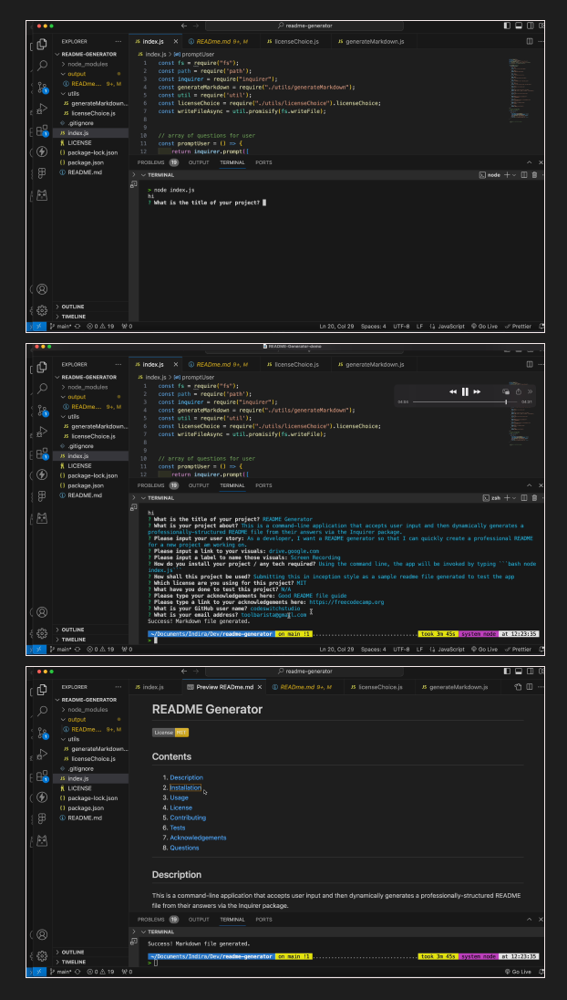

#  README Generator (inception-style)

[](https://opensource.org/licenses/MIT)

  
## Contents

1. [Description](#description) 
2. [Installation](#installation)
2. [Usage Information](#usage)
3. [License](#license)
4. [Contributing](#contributing)
5. [Tests](#tests)
6. [Acknowledgements](#acknowledgements)
7. [Questions](#questions)

---
## Description 

This is a command-line application that accepts user input and then dynamically generates it via the inquirer package. When a user is prompted for information about the project, their answers are rendered into a professionally structured markdown file. This allows the project creator to devote more time to working on the project rather than documentation.

---

**User Story** 

 - As a developer, I want a README generator so that I can quickly create a professional README for a new project.


---

**Visuals**

 - A walkthrough video demonstrating the functionality of the application may be found on [Google Drive](https://drive.google.com/file/d/1Hk-WdN9t7glphhChaDNyj0TUn1Eh-beQ/view?usp=sharing)

  - Screenshots



## Installation

  Please check the [inquirer documentation](https://www.npmjs.com/package/inquirer#installation)

---

## Usage

  Using the command line, the application will be invoked by using the following command:
```bash
node index.js
```

---

## License

  This application is covered by the following license:

  MIT

  

---

## Contributing

To contribute to this application, please follow the steps found on the [GitHub guide](https://docs.github.com/en/get-started/exploring-projects-on-github/contributing-to-a-project)

---

## Tests

Currently submitting this inputted text as a sample README generated using the application.

---

## Acknowledgements

 - [Good README Guide, Freecodecamp](https://www.freecodecamp.org/news/how-to-write-a-good-readme-file/)
 - [Inquirer Package](https://www.npmjs.com/package/inquirer)
 - [Node FS documentation](https://nodejs.org/api/fs.html)
 - [Stack Overflow](https://stackoverflow.com/questions/62597209/trying-to-generate-a-readme-using-nodejs)
 - [ChatGPT](https://chat.openai.com/)
 - [James Fisher](https://james-fisher-web-developer.herokuapp.com/pages/readme-generator.html)


## Questions
  For any further questions please contact:
* GitHub Username: (codeswitchstudio)
* GitHub Email: (toolbarista@gmail.com)
  
  
